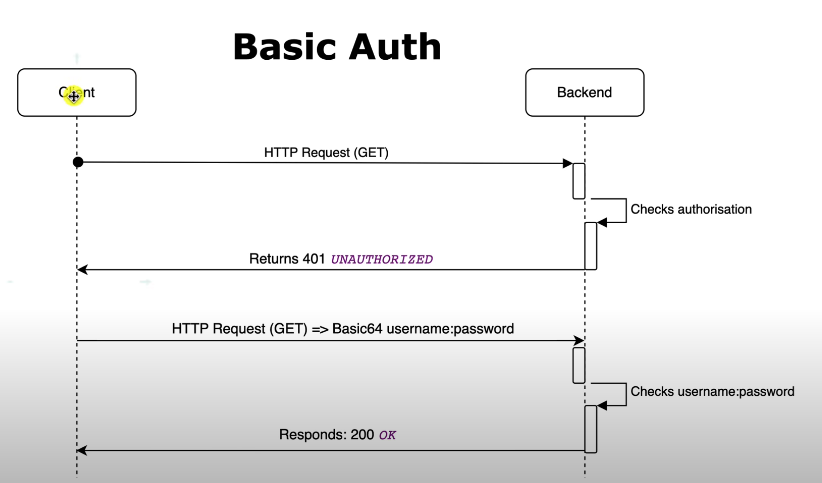

``` 
<version>${project.parent.version}</version>
``` 
from ```porm.xml``` file.
- This Line is Added to remove This Line of Error.
- Plugin 'org.springframework.boot:spring-boot-maven-plugin:' not found.


```
<dependency>
  <groupId>org.springframework.boot</groupId>
  <artifactId>spring-boot-starter-data-jpa</artifactId>
</dependency>
```
- Comment These Lines of Codes for:
  ``` Failed to configure a DataSource: 'url' attribute is not specified and no embedded datasource could be configured. ```
  ``` Reason: Failed to determine a suitable driver class ```

```aidl
// Create a Main class
public class Main {
  int x;  // Create a class attribute

  // Create a class constructor for the Main class
  public Main() {
    x = 5;  // Set the initial value for the class attribute x
  }

  public static void main(String[] args) {
    Main Obj = new Main(); // Create an object of class Main (This will call the constructor)
    System.out.println(Obj.x); // Print the value of x
  }
}

```
- Constructor
>### Facts About Spring Security

- **1st** Thing the when Spring Security Apps Starts up **Spring Boot** Looks for an OBJECT called **SecurityFilterChain** Which is a @Bean Object.
- By Navigating Through Spring Boot Declaration we can Find **SpringBootWebSecurityConfiguration.java** File
 
#### Most of the time we need to overwrite this Method


```
    @Bean
	@Order(SecurityProperties.BASIC_AUTH_ORDER)
	SecurityFilterChain defaultSecurityFilterChain(HttpSecurity http) throws Exception {
		http.authorizeRequests().anyRequest().authenticated();
		http.formLogin();
		http.httpBasic();
		return http.build();
	}
```
>#### How Basic Auth Works


>### @Transaction
> This Annotation is used to Prevent Entry of **Irrational Data in DB**.
> > A scenario Could be
> 
> >Situation One
> >>Let's Say A probable passengers Entered his/her Name, Birthday, Destination to Form One And Payment Details, Address to Another Form.
> 
> > Situation Two
> >> For Some Reason Paint Failed.
> 
> > Situation Three
> >> The Personal Information is already in the DB.
> 
>>> **Question is What would we Do with His/her Personal Details.**
> 
> >> Delete it. But How ??? 
> 
> >Solution
> >> Here Comes the **@Transaction**


>### File Structure
> >For JPA
> >>- One file for Entity(**Structure/Model Declaration of Database**). In This case **AppUser.java** file
> >>- One file for Repository(**Process of giving the Entry in DB**) Which **implements** the **JpaRepository** alon with primary key. Here **AppUserRepository.java** an Interface
 ```java
@Repository
public interface ConformationTokenRepository extends JpaRepository<ConformationToken, Long> {
Optional<ConformationToken> findByToken(String token);
}
```
> >>- One For Request(Which will Request Data From DB) Here it's called **RegistrationRequest.java**
> >>- One file for Service(all **business logic, end results, data showcase from database**)
> >>>In This case we have 2 Services.
> >>>> - *RegistrationService.java* (***Which will Get Data from Probable Future User if He/She not already present in the DB***)
> >>>> - *AppUserService.java* (**Which will Validate User and Send a Email to the Probable Future Email Address**)

### ```toString()```
#### The toString method is used to return a string representation of an object. 

>### ```@RequestParams``` vs ```@PathVariable```
> >#### ```@RequestParams``` extract values from the query string, ```@PathVariables``` extract values from the URI path
